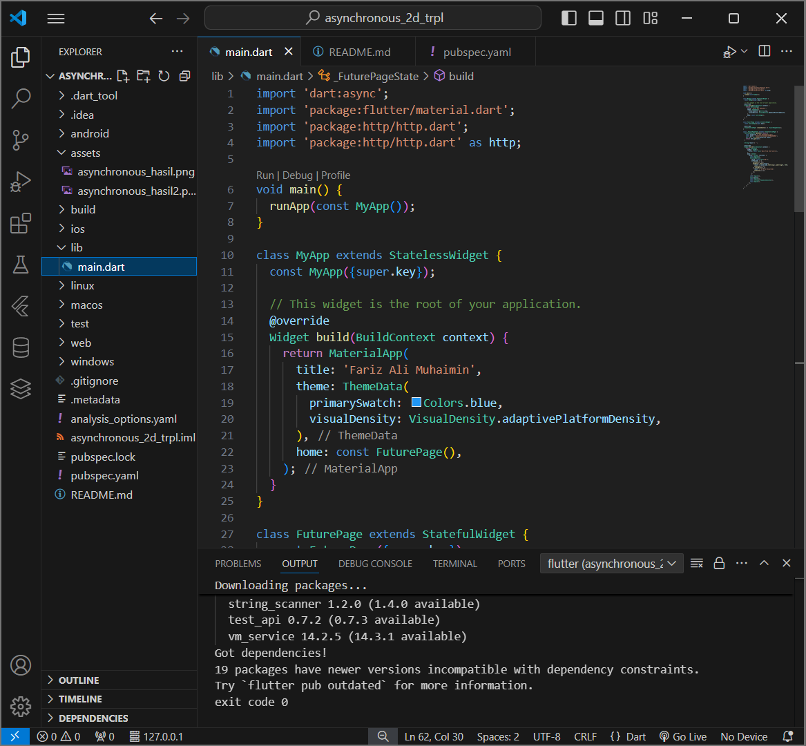
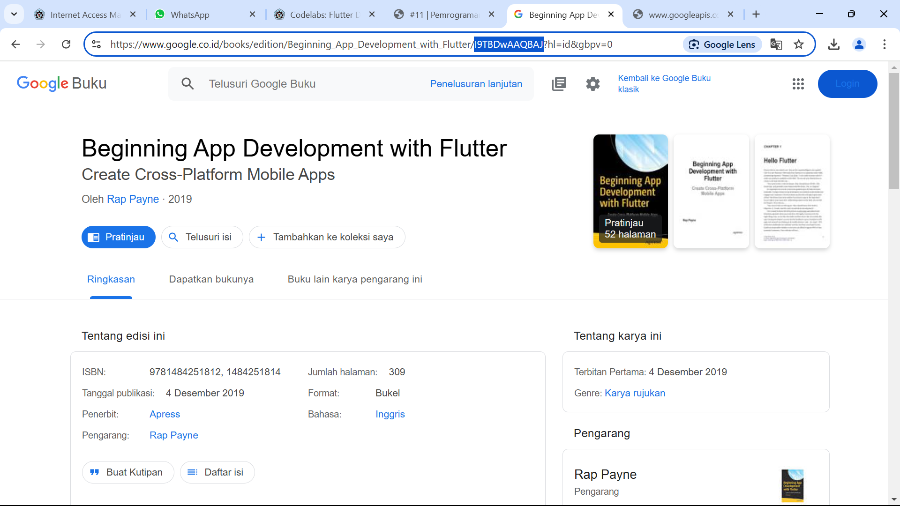
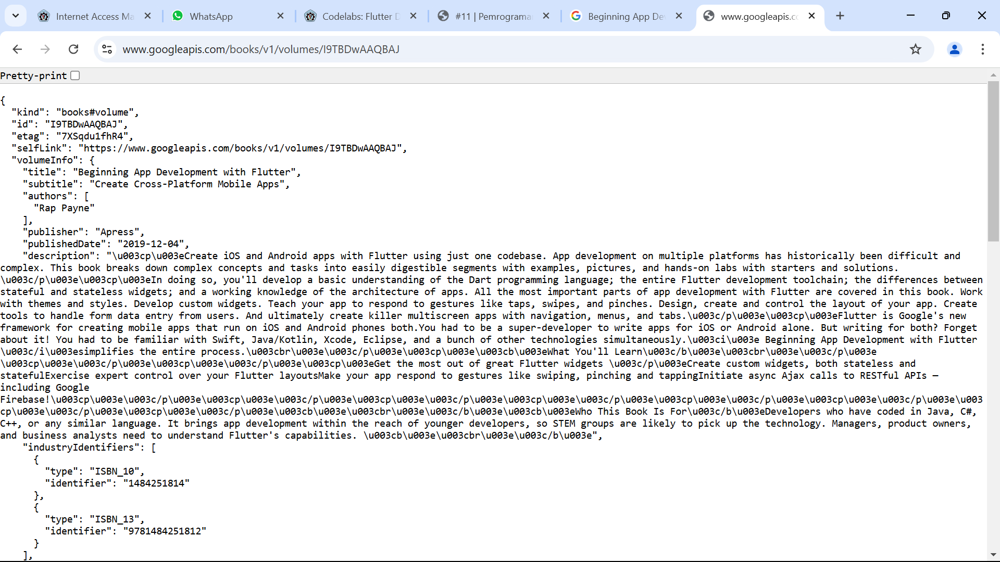
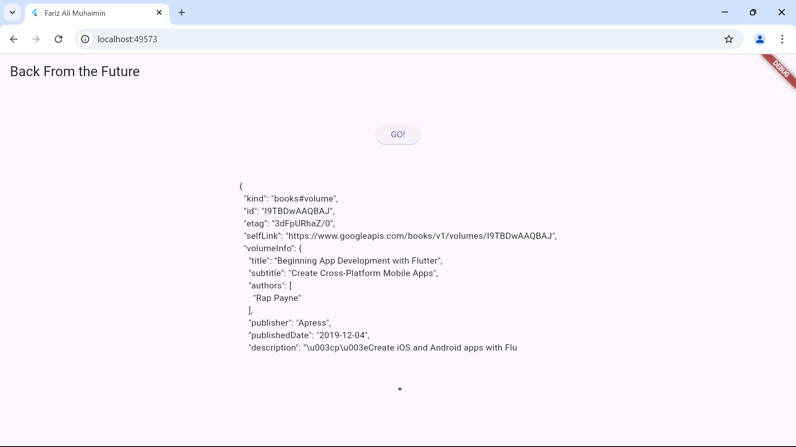
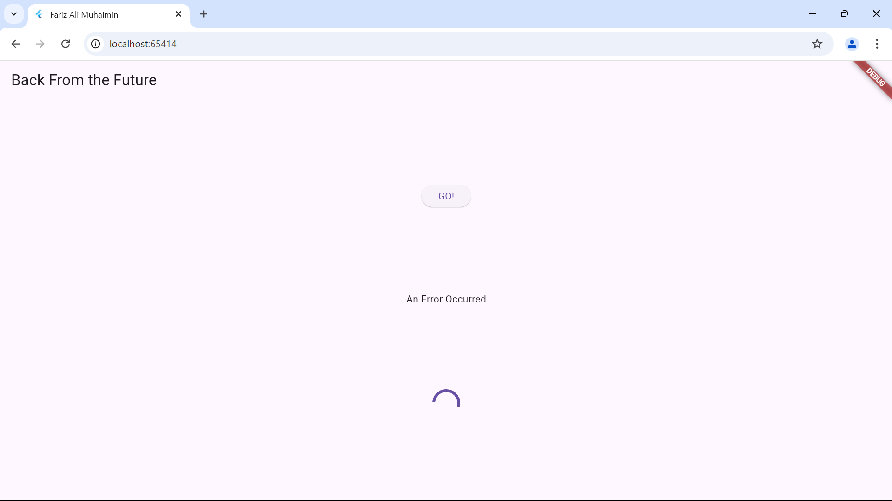
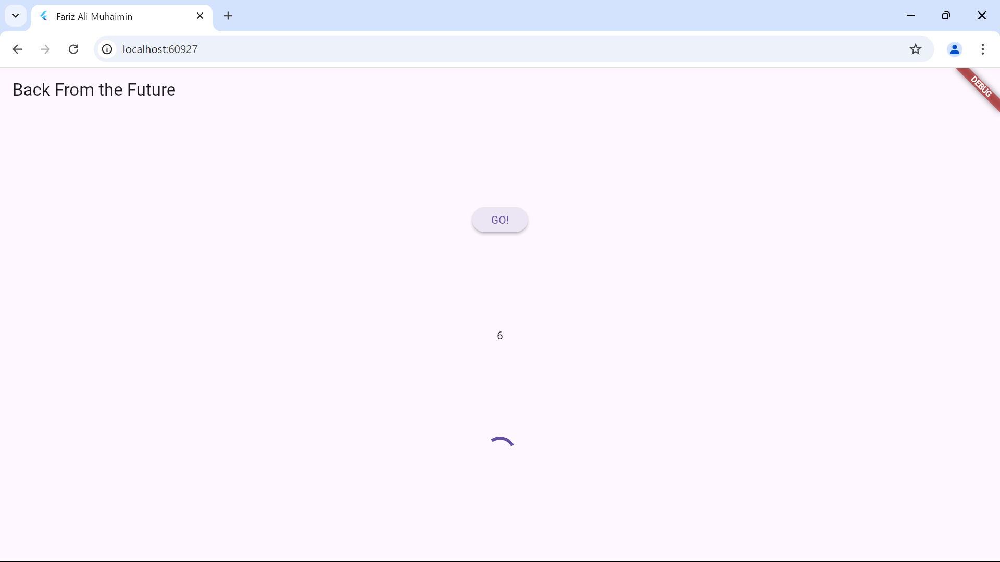
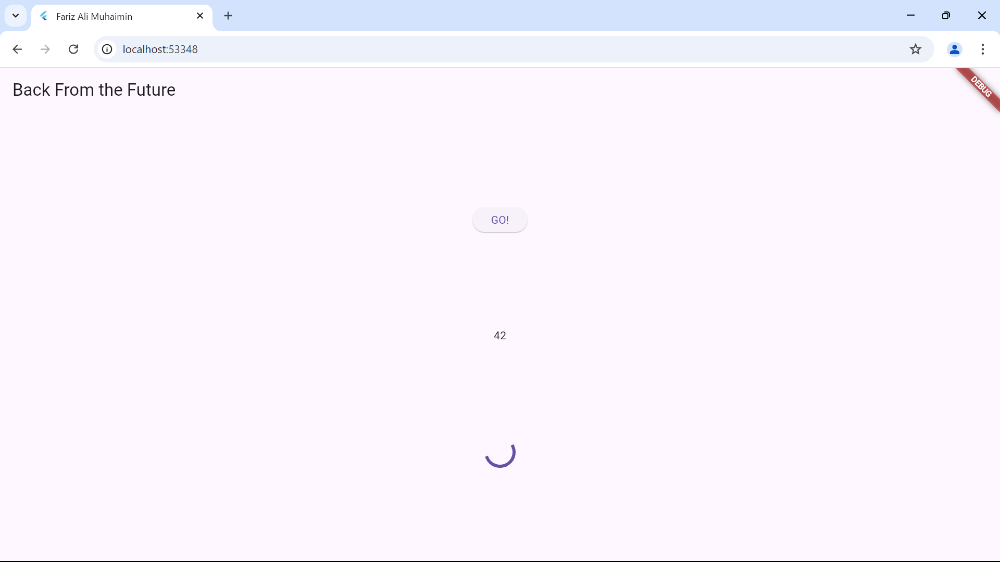

# asynchronous_2d_trpl

## Fariz Ali Muhaimin | 362358302100
## TRPL 2D

### soal 1
mengganti tittle dengan nama panggilan

### soal 2 
mencari judul buku

mengakses di Browser URI 

### soal 3
untuk substring digunakan untuk menampilkan sebagian data dari keseluruhan string. data yang diambil merupakan 450 karakter pertama dari String. sedangkan catchError digunakan apabila data yang diambil gagal atau tidak ada, misalnya apabila gagal untuk terhubung dengan apa yang dicari.

hasil untuk yang berhasil menampilkan data yang dicari

hasil untuk yang tidak berhasil menampilkan data yang dicari

### soal 4
untuk pada langkah nomor 1 tersebut digunakan untuk mendefinisikan kode yang digunakan untuk mengshitung total nilai dari tiga fungsi, dalam perhitungan tersebut masing-masing fungsi menunda eksekusi selama 3 detik dan setelahnya akan mengembalikan nilai integer setelah penundaan selesai. sedangkan pada langkah nomor 2 itu digunakan untuk menjumlahkan fungsi tersebut sehingga akan menghasilkan angka 6 dan jeda selama 9 detik.

hasil untuk kode tersebut

### soal 5
pada langkah nomor 2 digunakan untuk menghasilkan objek future dan melengkapinya dengan suatu nilai atau kesalahan yang di isikan pada "completer.complete()" yang terdapat pada kode tersebut. untuk menampilkan nilai tersebut diperlukan jeda selama 5 detik.

hasil 

### soal 6
